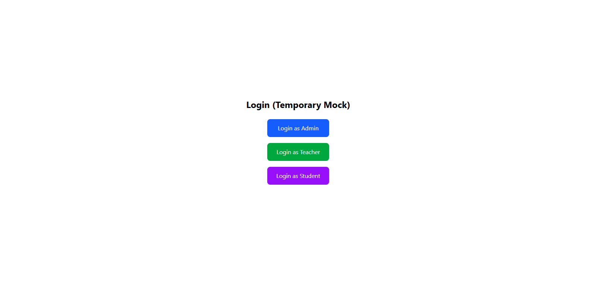
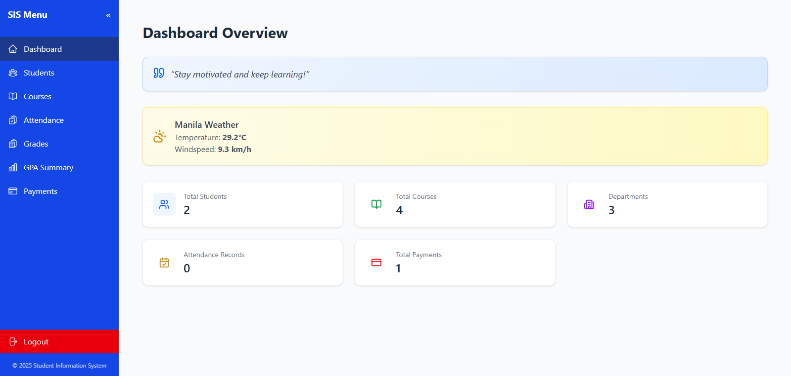
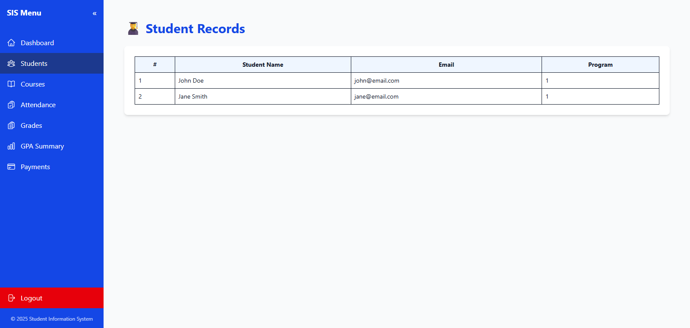
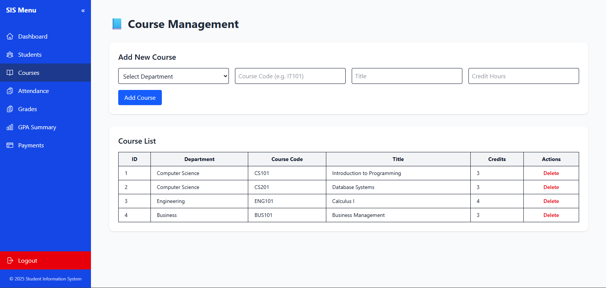
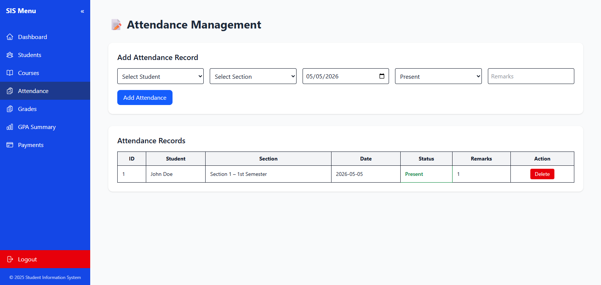
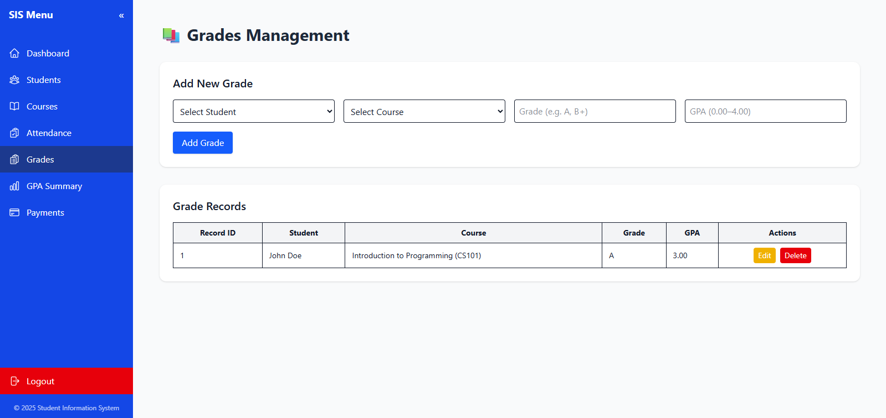
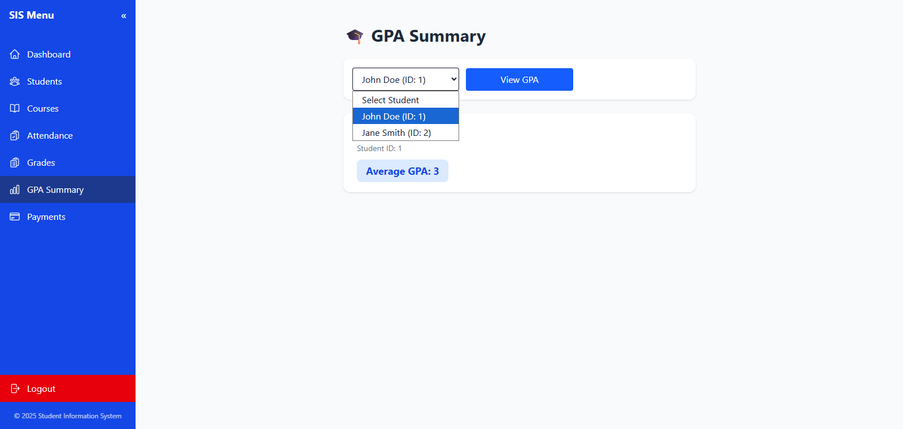
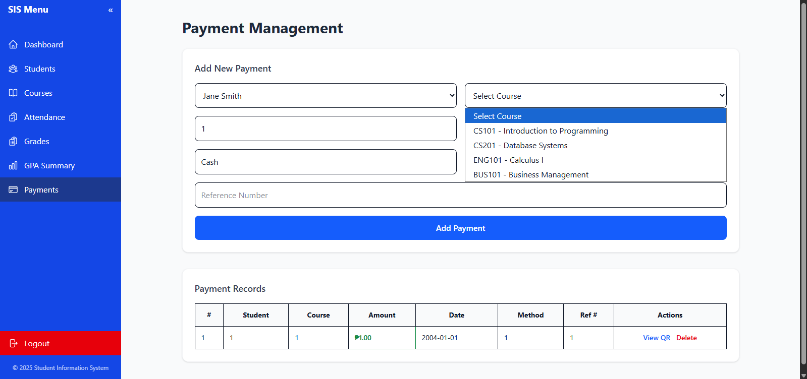
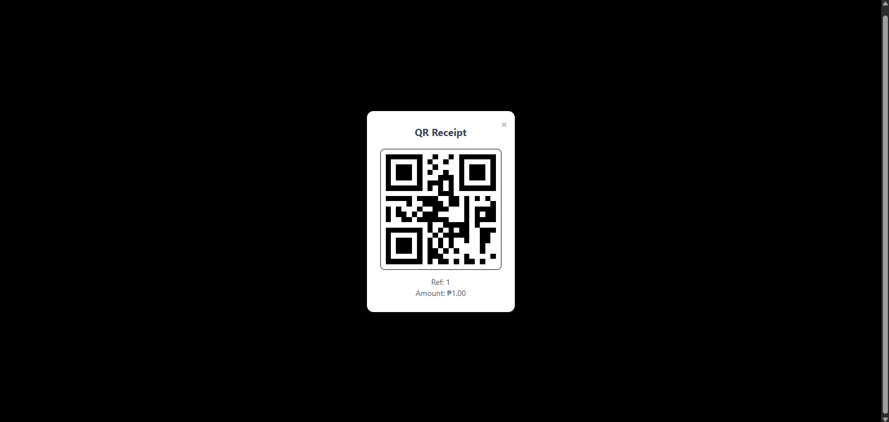

# Student Information System — Frontend

This is for our school project. We were tasked to build a front-end and a back-end and connect it using API as well as connect at least 3 external APIs(Quotes, Weather, QR code APIS were used and are all working and functional)

A React-based frontend for a Student Information System (SIS), built as a school project. Designed to pair with a separate **CodeIgniter 4 + PHP** REST API backend. Features role-based dashboards for administrators and teachers with modular API integration.

## Tech Stack

- **React 19** + **Vite 7** — Modern build tooling
- **React Router DOM 7** — Client-side routing with protected routes
- **Tailwind CSS 4** — Utility-first styling
- **Axios** — REST API communication
- **Recharts** — Data visualization
- **Heroicons & Lucide React** — Iconography

## Features

### Admin Portal
- **Dashboard Overview** — Live KPI cards (students, courses, departments, attendance, payments), weather widget, motivational quote widget
- **Student Records** — Browse student directory
- **Course Management** — Add, delete, and list courses with department linkage
- **Grade Management** — Full CRUD with inline editing, student/course dropdowns, GPA calculation integration
- **Attendance Tracking** — Add attendance records with section/student selectors, status color-coding (Present/Absent/Late/Excused)
- **Payment & Billing** — Record payments, view student balance in real time, generate QR-code receipts
- **GPA Summary** — Per-student GPA lookup with course breakdown table

### Teacher Portal
- **Dashboard** — Overview with class and attendance summaries
- **My Classes** — View assigned class sections and schedules
- **Attendance & Grade Entry** — *UI placeholders; backend endpoints ready*

### Architecture Highlights
- **Modular service layer** — Domain-separated API modules ([services/students.js](cci:7://file:///c:/Programming/sis-frontend/src/services/students.js:0:0-0:0), [services/grades.js](cci:7://file:///c:/Programming/sis-frontend/src/services/grades.js:0:0-0:0), etc.)
- **Role-based access control** — [ProtectedRoute](cci:1://file:///c:/Programming/sis-frontend/src/components/shared/ProtectedRoute.jsx:3:0-20:2) guards routes by admin/teacher role
- **Collapsible sidebar layouts** — Responsive navigation for admin and teacher views
- **AuthContext** — LocalStorage-based session persistence (mock login for demo)

## Project Structure
